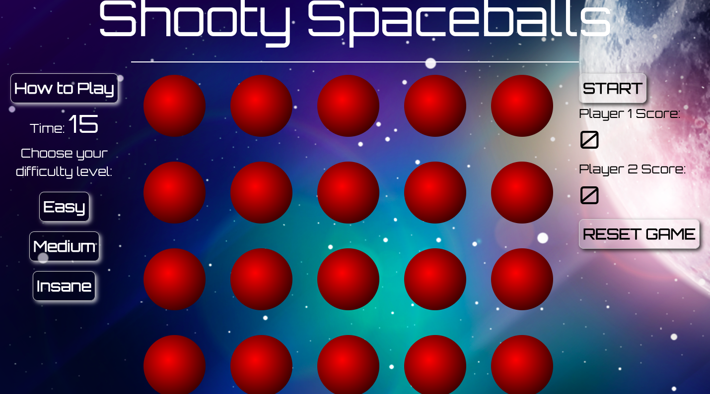
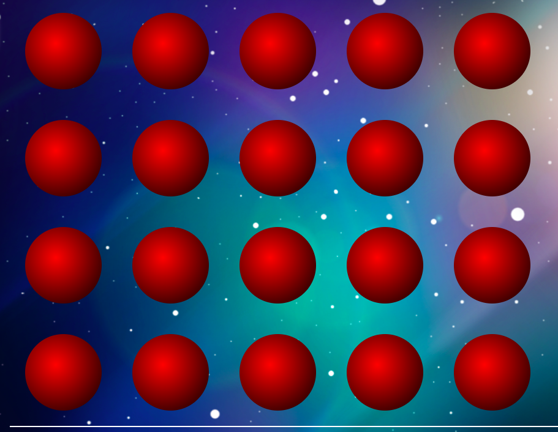
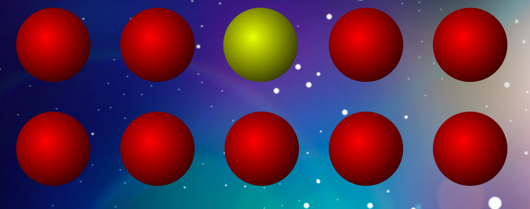
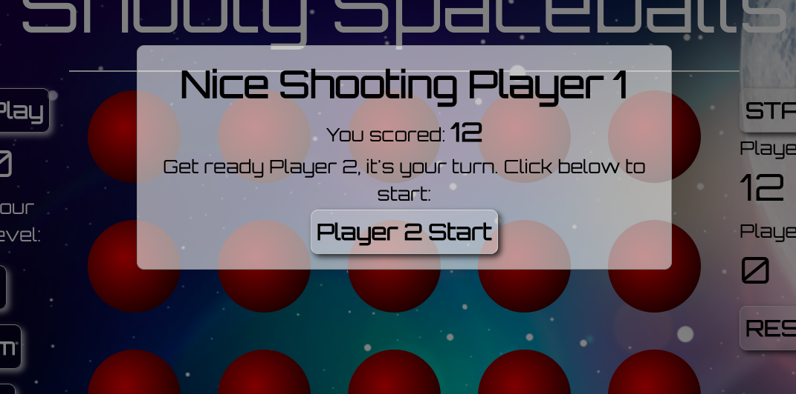

##Shooty Spaceballs

##General Assembly Project 1: Simple front-end game

###Goal: Creating a simple 2 player game using JavaScript, HTML and CSS.

###Technologies used:

* Javascript (ECMAScript 6) + jQuery
* HTML5
* HTML5 Audio
* SCSS
* Bulma
* Google Fonts
* Git
* Github

##Game Instructions

 'Shooty Spaceballs' is essentially a twist on the traditional Whack-a-Mole game.
 Instead of moles you must click on as many of the vibrating yellow spaceballs (planets, asteroids, who knows..) in
 a 15 second period. Your opponent must then try to better that score.

 * Game instructions are available at the click of the 'How to Play' button on the left.

 * A difficulty level can also be set with a click of a button.

 

 * The game begins when the start button is pressed. This triggers the countdown and the board to go live.

 

 * The red balls will highlight yellow and 'vibrate' at random intervals, determined by the difficulty level selected using the buttons on the left of the screen.

 

 

 * Once player one has completed their game their score is displayed and player two's game begins. Once this is complete a screen displays the winner.

##Development

My aim was to keep the game fairly simple - I wanted to ensure I had a functioning game by the end of the project that mixed the skills we had been studying during the first part of the course.

I tried to mix a bit of everything into it, to help consolidate my learning so far - hence I used jQuery, a Bulma framework, SASS, CSS animation and HTML Audio.

Planning out the logic took a couple of days. After struggling for the first 24 hours it became much clearer and everything flowed from then on.

It was very useful seeing the numerous other similar games on line and how they had (often very differently) approached the game logic.

Once I had decided on the space theme and added a background image, futuristic font and couple of sfx it lifted the fairly straightforward gameplay.

##What I Learned

* In retrospect I could have taken on a more challenging project even thought I was pleased with the end result. It works and looks ok! It **vastly** improved my understanding of the entire process and my JavaScript and styling particularly took a massive leap. It helped me realise how much I'd learnt.

* Certain problems, such as making it two player and getting the timers to work correctly seem to take forever, but once I'd worked them out they seemed very logical. I realised that sometimes staring at the screen for 6 hours stright is not always the way to solve a problem.

* I would have liked to have made it responsive and also ensure the reset button reset without refreshing (especially once I added the fairly irritating background music  - despite the mute button).

* Hopefully with more concise planning and a more focused approach - as well as allowing sufficient time for styling, my next project will flow even better.
